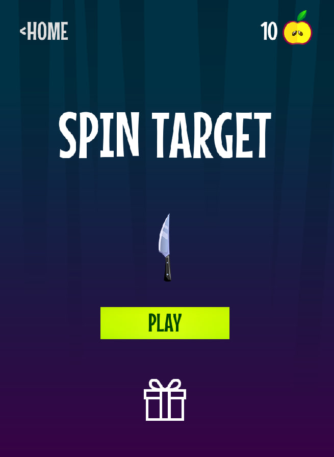
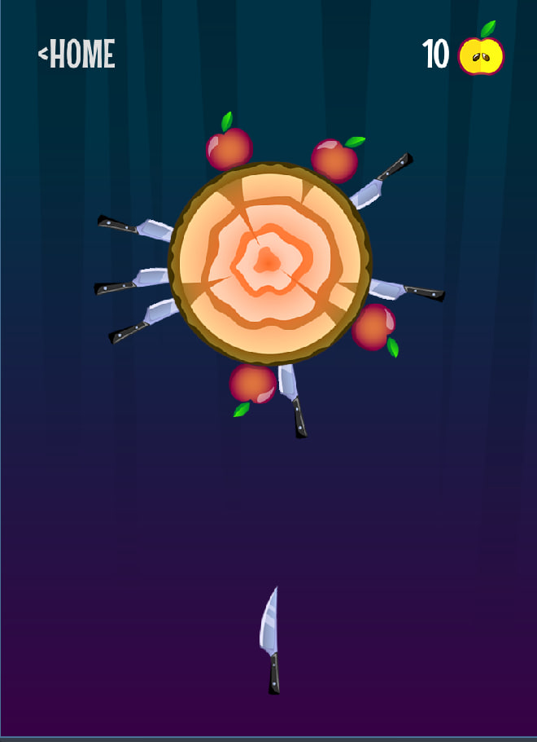
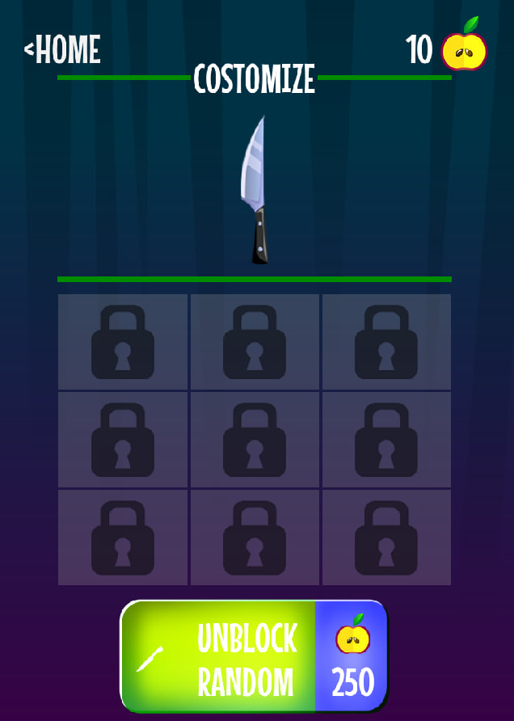

# Spin Target

**Spin Target** - учебная аркадная игра на Godot 4. Игрок бросает ножи во вращающуюся мишень, старается попадать по яблокам, зарабатывать очки и проходить уровни, не попадая в уже воткнутые ножи. В проекте есть магазин ножей, разные характеристики оружия, комбо за точные попадания, боссы, визуальные эффекты, музыка и сохранение прогресса. Игра ориентирована на мобильный вертикальный экран и подготовлена для демонстрационной сборки под ОС Аврора и Android.

## Скриншоты

| Стартовый экран | Игровой процесс | Магазин |
| --- | --- | --- |
|  |  |  |

## Технологический стек

- **Godot Engine 4.4** - игровой движок и редактор проекта.
- **GDScript** - основной язык игровой логики.
- **ОС Аврора** - целевая платформа для RPM-сборки.
- **Android** - мобильная платформа для APK-сборки.
- **GitHub Releases** - публикация готовых демонстрационных файлов.

## Что есть в игре

- метание ножей во вращающуюся мишень;
- яблоки, награды и комбо за точные попадания;
- разные ножи с индивидуальными характеристиками;
- магазин и сохранение прогресса игрока;
- уровни, боссы, победные и проигрышные состояния;
- звуковые эффекты, музыка, частицы и визуальная обратная связь.

## Структура проекта

- `spin-target/` - основной Godot-проект.
- `spin-target/project.godot` - файл проекта, который нужно открывать в Godot.
- `spin-target/assets/` - изображения, иконки, музыка, звуки и скриншоты.
- `spin-target/core/` - глобальные скрипты, события и менеджеры.
- `spin-target/elements/` - игровые элементы: ножи, яблоки, мишени и UI.
- `spin-target/scens/` - основные сцены игры, магазина и стартового экрана.
- `docs/` - подробная документация по архитектуре, механикам, UI, аудио и эффектам.
- `LICENSE` - лицензия проекта.

## Как запустить проект локально

1. Установите **Godot Engine 4.4.1** или совместимую версию Godot 4.4.
2. Склонируйте репозиторий:

```bash
git clone https://github.com/top-it-090304/Spin-Target.git
cd Spin-Target
```

3. Откройте файл `spin-target/project.godot` через Godot.
4. Запустите проект кнопкой **Run Project** в редакторе.

## Как собрать

Сборки выполняются через экспортные пресеты Godot в файле `spin-target/export_presets.cfg`.

### Android

1. Откройте `spin-target/project.godot` в Godot.
2. Проверьте настройки Android SDK и JDK в настройках редактора.
3. Откройте **Project -> Export**.
4. Выберите пресет **Android**.
5. Экспортируйте APK-файл для установки на устройство.

### ОС Аврора

Готовая демонстрационная сборка для ОС Аврора публикуется как RPM-пакет в GitHub Releases. Для локальной пересборки используйте настроенное окружение сборки под Аврору и исходники Godot-проекта из каталога `spin-target/`.

## Релиз demo-2026-05-18

Демонстрационный релиз должен быть опубликован в GitHub Releases с тегом `demo-2026-05-18`. В релиз прикладываются готовые файлы сборок с понятными именами:

- `SpinTarget-demo-2026-05-18-AuroraOS.rpm` - версия для ОС Аврора.
- `SpinTarget-demo-2026-05-18-Android.apk` - версия для Android.

Если APK или RPM пересобираются заново, имя файла в релизе нужно оставить таким же понятным: название проекта, дата демо и платформа.

## Документация

Подробные материалы находятся в каталоге `docs/`:

- [Архитектура](docs/architecture.md)
- [Игровые механики](docs/mechanics.md)
- [Ножи и характеристики](docs/knives.md)
- [Комбо и очки](docs/combo-and-scoring.md)
- [Прогрессия](docs/progression.md)
- [UI](docs/ui.md)
- [Аудио](docs/audio.md)
- [Визуальные эффекты](docs/visual-effects.md)

## Лицензия

Проект распространяется по лицензии MIT. Текст лицензии находится в файле [LICENSE](LICENSE).
